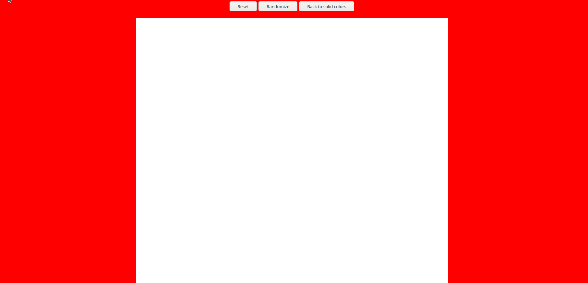

This is a basic etch-a-sketch web page, using mouseover events and div elements generated by javascript. The size is restricted to its container, so the same amount of pixels is always used, but the exact size of the boxes can be adjusted, the higher the number entered the smaller the boxes and vice versa. Enter a number between 1-100 when prompted after hitting the reset button, the randomize button changes the boxes to random colors when drawn, and the 'back to solid colors' option puts everything back to basic black and white. 

